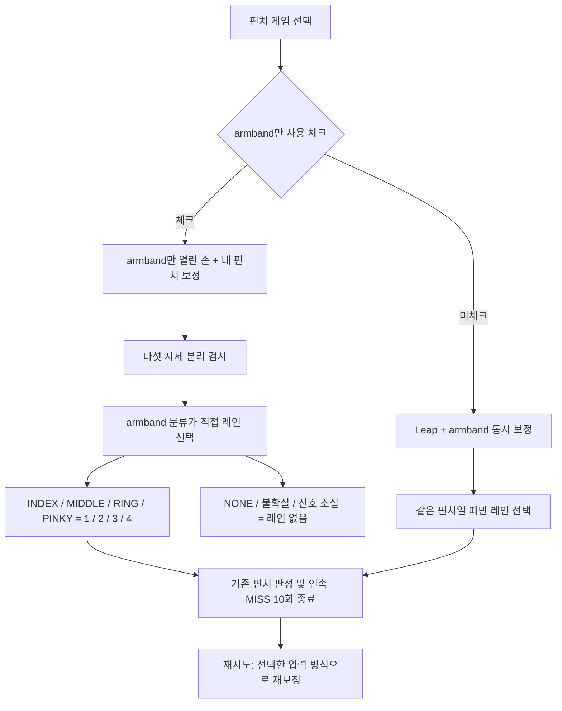

# Armband 단독 테스트 흐름

EXTRACTED: 제거된 armband 단독 테스트의 과거 입력 경로다. 현재는 [Leap 전용](pinch-leap-only.md)을 사용한다.

```mermaid
flowchart TD
    A[핀치 게임 선택] --> B{armband만 사용 체크}
    B -->|체크| C[armband만 열린 손 + 네 핀치 보정]
    C --> D[다섯 자세 분리 검사]
    D --> E[armband 분류가 직접 레인 선택]
    E --> F[INDEX / MIDDLE / RING / PINKY = 1 / 2 / 3 / 4]
    E --> G[NONE / 불확실 / 신호 소실 = 레인 없음]
    B -->|미체크| H[Leap + armband 동시 보정]
    H --> I[같은 핀치일 때만 레인 선택]
    F --> J[기존 핀치 판정 및 연속 MISS 10회 종료]
    I --> J
    J --> K[재시도: 선택한 입력 방식으로 재보정]
```
