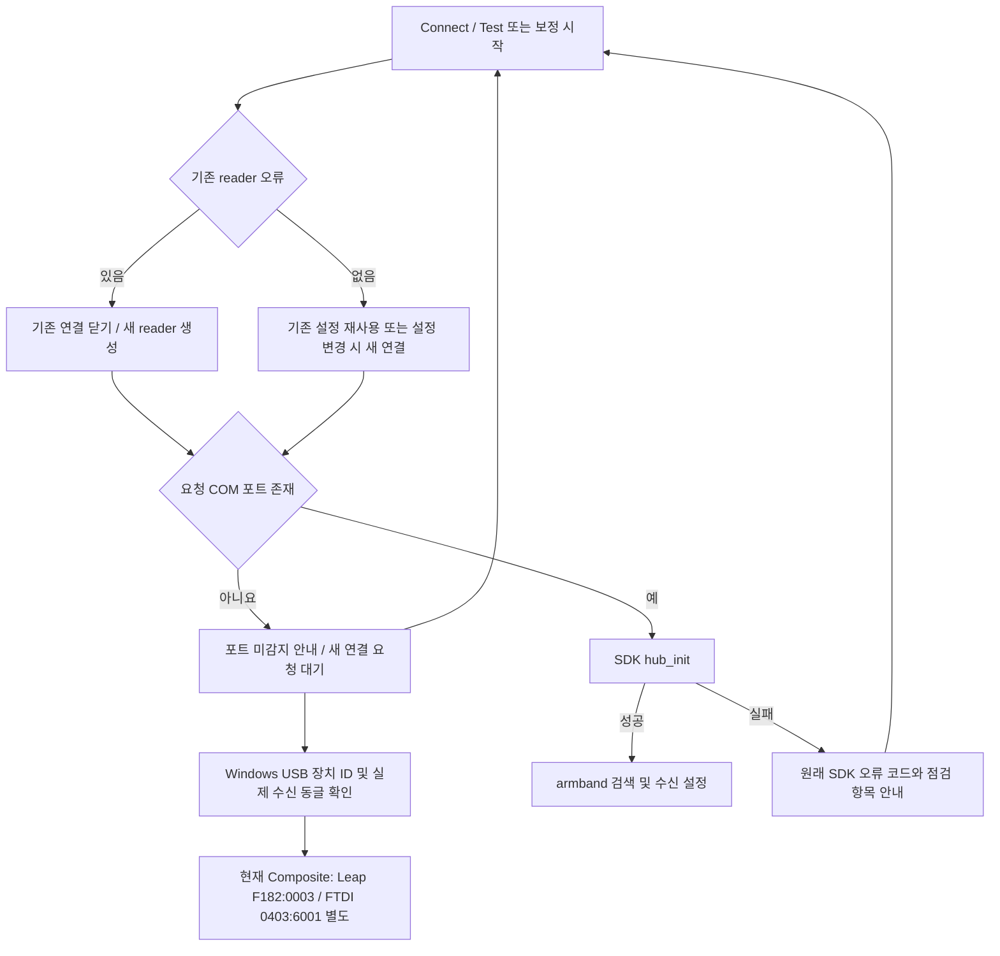

# Armband 오류 후 재시도

EXTRACTED: 연결 요청 및 SDK 초기화 경로.

```mermaid
flowchart TD
    A[Connect / Test 또는 보정 시작] --> B{기존 reader 오류}
    B -->|있음| C[기존 연결 닫기 / 새 reader 생성]
    B -->|없음| D[기존 설정 재사용 또는 설정 변경 시 새 연결]
    C --> E{요청 COM 포트 존재}
    D --> E
    E -->|아니요| F[포트 미감지 안내 / 새 연결 요청 대기]
    F --> P[Windows USB 장치 ID 및 실제 수신 동글 확인]
    P --> Q[현재 Composite: Leap F182:0003 / FTDI 0403:6001 별도]
    E -->|예| G[SDK hub_init]
    G -->|성공| H[armband 검색 및 수신 설정]
    G -->|실패| I[원래 SDK 오류 코드와 점검 항목 안내]
    F --> A
    I --> A
```
