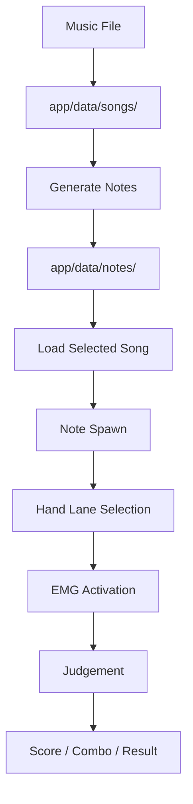

Data Flow Diagram

```mermaid
graph TD
    A[Music File] --> B[app/data/songs/]
    B --> C[Generate Notes]
    C --> D[app/data/notes/]
    D --> E[Load Selected Song]
    E --> F[Note Spawn]
    F --> G[Hand Lane Selection]
    G --> H[EMG Activation]
    H --> I[Judgement]
    I --> J[Score / Combo / Result]
```
