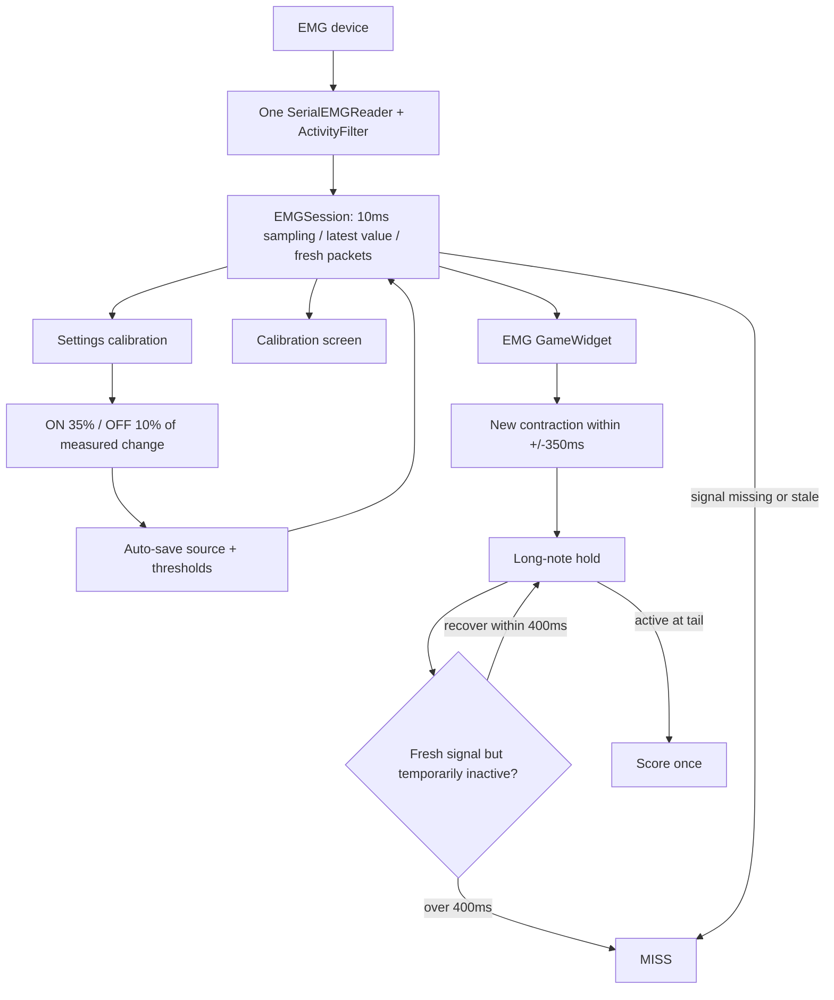

# EXTRACTED: 공유 EMG 처리와 완화된 판정

EXTRACTED: 이전 ON/OFF 보정 방식의 기록이다. 현재 게임 입력은 [3초 안정 기준 +0.01](emg-rest-baseline.md)을 사용한다.

```mermaid
flowchart TD
    Device[EMG device] --> Reader[One SerialEMGReader + ActivityFilter]
    Reader --> Session[EMGSession: 10ms sampling / latest value / fresh packets]
    Session --> Settings[Settings calibration]
    Session --> Calibration[Calibration screen]
    Session --> Game[EMG GameWidget]
    Settings --> Threshold[ON 35% / OFF 10% of measured change]
    Threshold --> Save[Auto-save source + thresholds]
    Save --> Session
    Game --> Beat[New contraction within +/-350ms]
    Beat --> Hold[Long-note hold]
    Hold --> Dip{Fresh signal but temporarily inactive?}
    Dip -->|recover within 400ms| Hold
    Dip -->|over 400ms| Miss[MISS]
    Session -->|signal missing or stale| Miss
    Hold -->|active at tail| Score[Score once]
```
