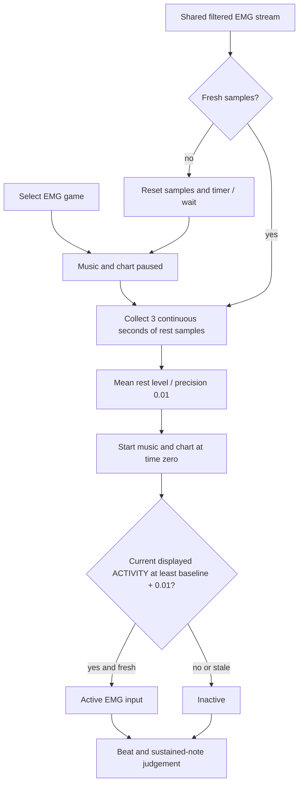

# EXTRACTED: 시작 전 3초 안정 측정

```mermaid
flowchart TD
    Select[Select EMG game] --> Wait[Music and chart paused]
    Stream[Shared filtered EMG stream] --> Fresh{Fresh samples?}
    Fresh -->|no| Reset[Reset samples and timer / wait]
    Reset --> Wait
    Wait --> Measure[Collect 3 continuous seconds of rest samples]
    Fresh -->|yes| Measure
    Measure --> Baseline[Mean rest level / precision 0.01]
    Baseline --> Start[Start music and chart at time zero]
    Start --> Compare{Current displayed ACTIVITY at least baseline + 0.01?}
    Compare -->|yes and fresh| Active[Active EMG input]
    Compare -->|no or stale| Inactive[Inactive]
    Active --> Judge[Beat and sustained-note judgement]
    Inactive --> Judge
```
