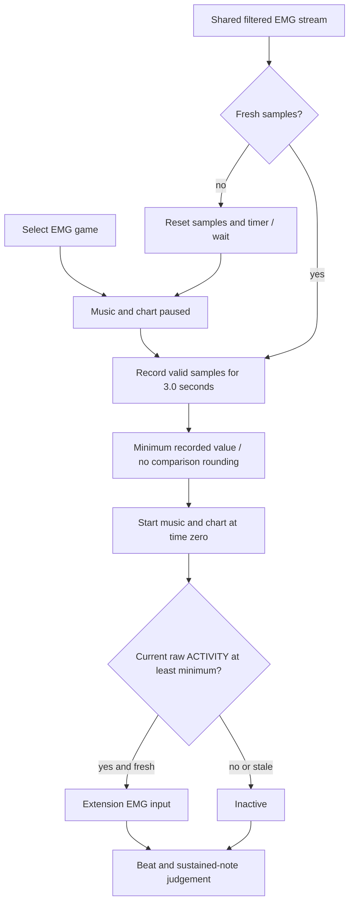

# EXTRACTED: 시작 전 3.0초 기록의 최저값 기준

```mermaid
flowchart TD
    Select[Select EMG game] --> Wait[Music and chart paused]
    Stream[Shared filtered EMG stream] --> Fresh{Fresh samples?}
    Fresh -->|no| Reset[Reset samples and timer / wait]
    Reset --> Wait
    Wait --> Measure[Record valid samples for 3.0 seconds]
    Fresh -->|yes| Measure
    Measure --> Baseline[Minimum recorded value / no comparison rounding]
    Baseline --> Start[Start music and chart at time zero]
    Start --> Compare{Current raw ACTIVITY at least minimum?}
    Compare -->|yes and fresh| Active[Extension EMG input]
    Compare -->|no or stale| Inactive[Inactive]
    Active --> Judge[Beat and sustained-note judgement]
    Inactive --> Judge
```
