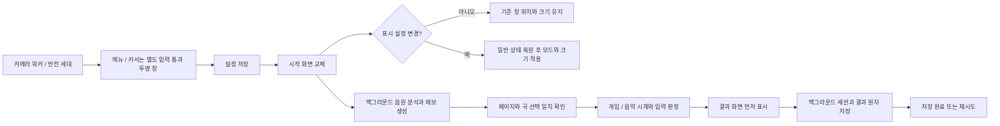

# 전시 처리 흐름 (EXTRACTED)

```mermaid
flowchart LR
    Hand[카메라 워커 / 반전 세대] --> Menu[메뉴 / 커서는 별도 입력 통과 투명 창]
    Menu --> Save[설정 저장]
    Save --> Start[시작 화면 교체]
    Start --> Display{표시 설정 변경?}
    Display -->|아니오| Keep[기존 창 위치와 크기 유지]
    Display -->|예| Apply[일반 상태 복원 후 모드와 크기 적용]
    Start --> Job[백그라운드 음원 분석과 채보 생성]
    Job --> Guard[페이지와 곡 선택 일치 확인]
    Guard --> Game[게임 / 음악 시계와 입력 판정]
    Game --> Result[결과 화면 먼저 표시]
    Result --> IO[백그라운드 세션과 결과 원자 저장]
    IO --> Status[저장 완료 또는 재시도]
```
