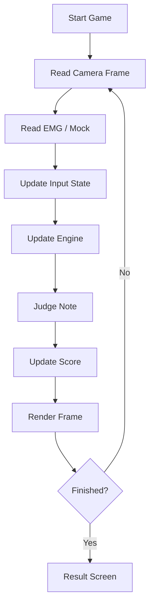

Game Loop Diagram

```mermaid
graph TD
    A[Start Game] --> B[Read Camera Frame]
    B --> C[Read EMG / Mock]
    C --> D[Update Input State]
    D --> E[Update Engine]
    E --> F[Judge Note]
    F --> G[Update Score]
    G --> H[Render Frame]
    H --> I{Finished?}
    I -- No --> B
    I -- Yes --> J[Result Screen]
```
