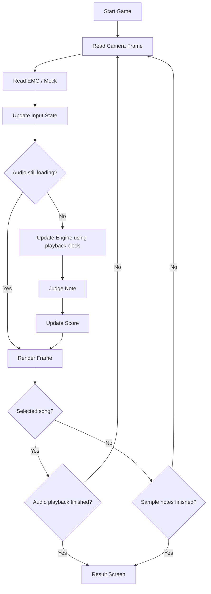

Game Loop Diagram

```mermaid
graph TD
    A[Start Game] --> B[Read Camera Frame]
    B --> C[Read EMG / Mock]
    C --> D[Update Input State]
    D --> L{Audio still loading?}
    L -- Yes --> H
    L -- No --> E[Update Engine using playback clock]
    E --> F[Judge Note]
    F --> G[Update Score]
    G --> H[Render Frame]
    H --> K{Selected song?}
    K -- Yes --> I{Audio playback finished?}
    K -- No --> N{Sample notes finished?}
    I -- No --> B
    I -- Yes --> J[Result Screen]
    N -- No --> B
    N -- Yes --> J
```

EXTRACTED: 선택 곡은 오디오 재생 완료 시 종료하고, 샘플 모드 또는 재생 오류 시 노트 기반 종료 조건을 사용합니다.
