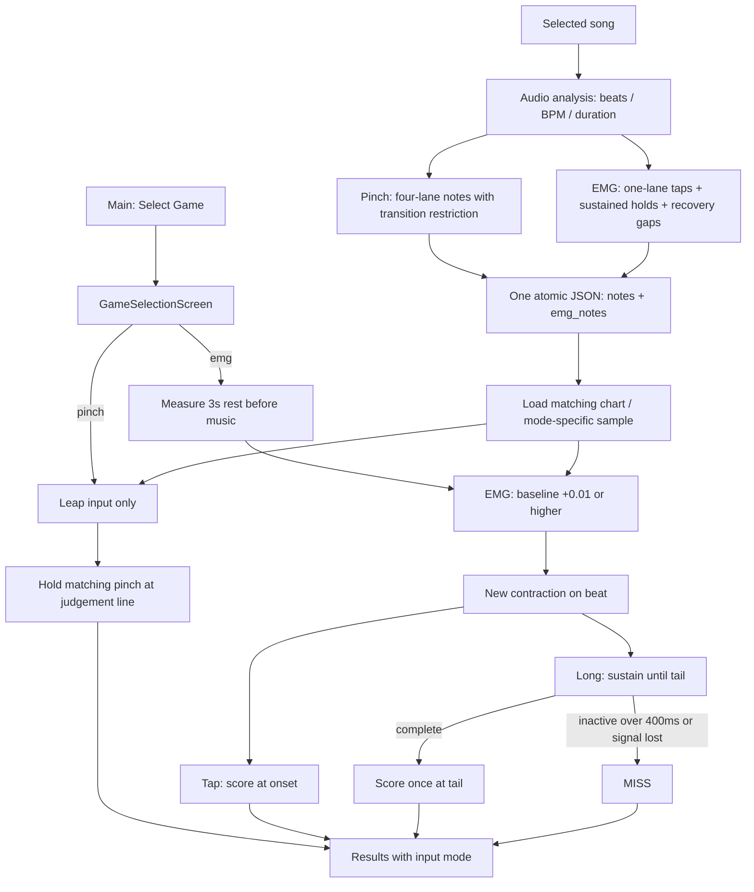

# EXTRACTED: 두 게임 모드와 공유 노래 분석

```mermaid
flowchart TD
    Song[Selected song] --> Analysis[Audio analysis: beats / BPM / duration]
    Analysis --> PinchChart[Pinch: four-lane notes with transition restriction]
    Analysis --> EmgChart[EMG: one-lane taps + sustained holds + recovery gaps]
    PinchChart --> Save[One atomic JSON: notes + emg_notes]
    EmgChart --> Save
    Main[Main: Select Game] --> Select[GameSelectionScreen]
    Select -->|pinch| Pinch[Leap input only]
    Select -->|emg| Rest[Measure 3s rest before music]
    Rest --> Emg[EMG: baseline +0.01 or higher]
    Save --> Load[Load matching chart / mode-specific sample]
    Load --> Pinch
    Load --> Emg
    Pinch --> PinchJudge[Hold matching pinch at judgement line]
    Emg --> Tap[New contraction on beat]
    Tap --> Short[Tap: score at onset]
    Tap --> Hold[Long: sustain until tail]
    Hold -->|inactive over 400ms or signal lost| Miss[MISS]
    Hold -->|complete| Score[Score once at tail]
    PinchJudge --> Results[Results with input mode]
    Short --> Results
    Score --> Results
    Miss --> Results
```
