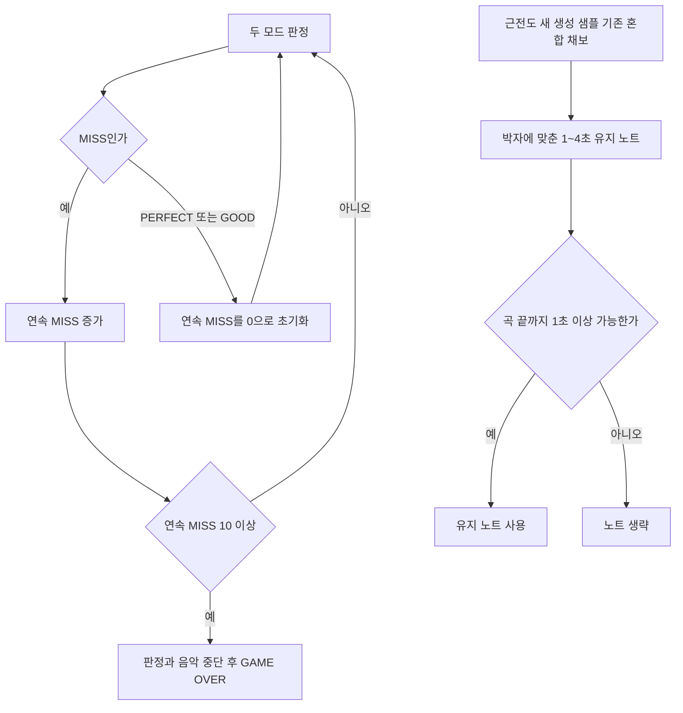

# 최신 종료·근전도 채보 규칙

EXTRACTED: 2026-11-18 구현 기준.

```mermaid
flowchart TD
    Result[두 모드 판정] --> Miss{MISS인가}
    Miss -->|예| Count[연속 MISS 증가]
    Miss -->|PERFECT 또는 GOOD| Keep[연속 MISS를 0으로 초기화]
    Count --> Limit{연속 MISS 10 이상}
    Limit -->|예| End[판정과 음악 중단 후 GAME OVER]
    Limit -->|아니오| Result
    Keep --> Result
    Source[근전도 새 생성 샘플 기존 혼합 채보] --> Holds[박자에 맞춘 1~4초 유지 노트]
    Holds --> Space{곡 끝까지 1초 이상 가능한가}
    Space -->|예| Save[유지 노트 사용]
    Space -->|아니오| Skip[노트 생략]
```
