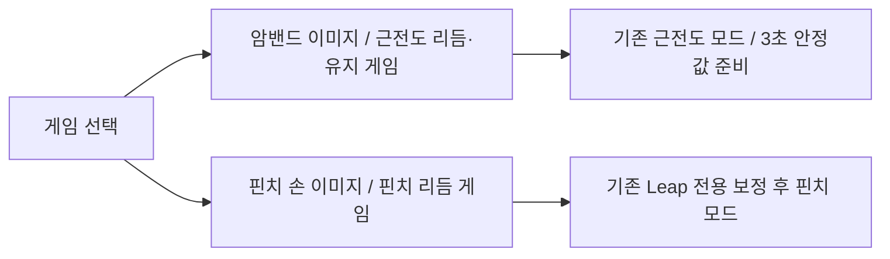

# 이미지 카드에서 게임 선택

EXTRACTED: 게임 선택 화면의 이미지 매핑과 기존 진입 경로.

```mermaid
flowchart LR
    A[게임 선택] --> E[암밴드 이미지 / 근전도 리듬·유지 게임]
    A --> P[핀치 손 이미지 / 핀치 리듬 게임]
    E --> EC[기존 근전도 모드 / 3초 안정값 준비]
    P --> PC[기존 Leap 전용 보정 후 핀치 모드]
```
