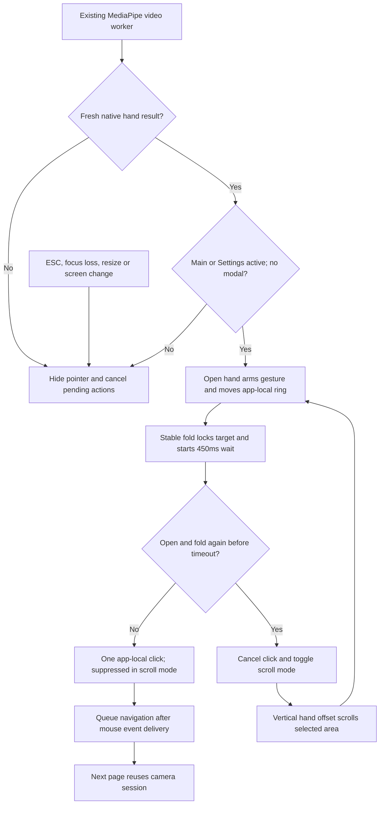

# Hand cursor flow

```mermaid
flowchart TD
    MP[Existing MediaPipe video worker] --> VALID{Fresh native hand result?}
    VALID -- No --> RESET[Hide pointer and cancel pending actions]
    VALID -- Yes --> SCOPE{Main or Settings active; no modal?}
    SCOPE -- No --> RESET
    SCOPE -- Yes --> OPEN[Open hand arms gesture and moves app-local ring]
    OPEN --> FOLD[Stable fold locks target and starts 450ms wait]
    FOLD --> AGAIN{Open and fold again before timeout?}
    AGAIN -- No --> CLICK[One app-local click; suppressed in scroll mode]
    CLICK --> NEXT[Queue navigation after mouse event delivery]
    NEXT --> SHARE[Next page reuses camera session]
    AGAIN -- Yes --> MODE[Cancel click and toggle scroll mode]
    MODE --> VERTICAL[Vertical hand offset scrolls selected area]
    VERTICAL --> OPEN
    ESC[ESC, focus loss, resize or screen change] --> RESET
```

EXTRACTED: No OS cursor movement or global input injection. Games and other screens are excluded.
