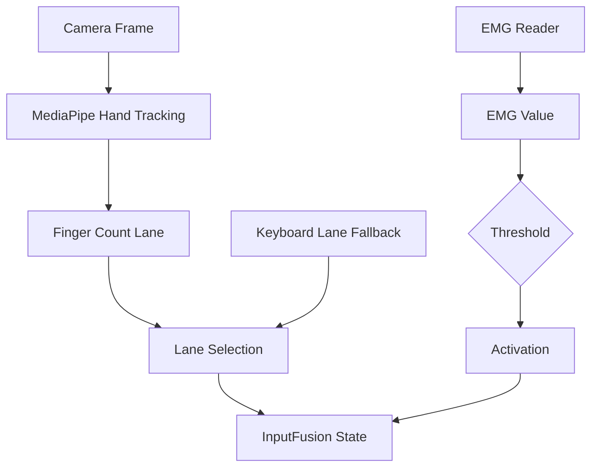

Input Flow Diagram

```mermaid
graph TD
    A[Camera Frame] --> B[MediaPipe Hand Tracking]
    B --> C[Finger Count Lane]
    C --> D[Lane Selection]
    E[Keyboard Lane Fallback] --> D
    F[EMG Reader] --> G[EMG Value]
    G --> H{Threshold}
    H --> I[Activation]
    D --> J[InputFusion State]
    I --> J
```
