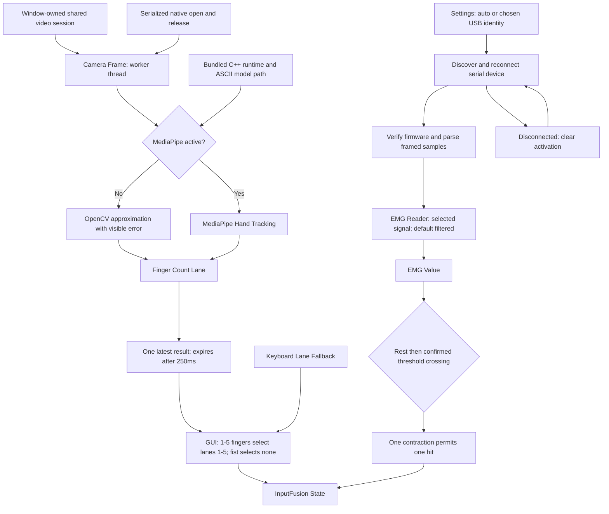

Input Flow Diagram

```mermaid
graph TD
    SESSION[Window-owned shared video session] --> A[Camera Frame: worker thread]
    LOCK[Serialized native open and release] --> A
    A --> M{MediaPipe active?}
    RUNTIME[Bundled C++ runtime and ASCII model path] --> M
    M -- Yes --> B[MediaPipe Hand Tracking]
    M -- No --> FALLBACK[OpenCV approximation with visible error]
    FALLBACK --> C
    B --> C[Finger Count Lane]
    C --> LATEST[One latest result; expires after 250ms]
    LATEST --> D[GUI: 1-5 fingers select lanes 1-5; fist selects none]
    E[Keyboard Lane Fallback] --> D
    P[Settings: auto or chosen USB identity] --> Q[Discover and reconnect serial device]
    Q --> R[Verify firmware and parse framed samples]
    R --> F[EMG Reader: selected signal; default filtered]
    F --> G[EMG Value]
    Q --> S[Disconnected: clear activation]
    S --> Q
    G --> H{Rest then confirmed threshold crossing}
    H --> I[One contraction permits one hit]
    D --> J[InputFusion State]
    I --> J
```
