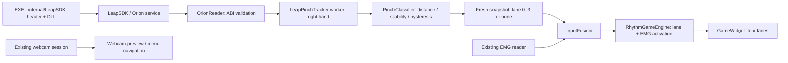

# EXTRACTED: Leap 4레인 입력 흐름

EXTRACTED: 웹캠을 유지하던 중간 버전 기록. 최신 구조는 [Leap 전용 흐름](leap-only.md)을 확인한다.

```mermaid
flowchart LR
    Bundle[EXE _internal/LeapSDK: header + DLL] --> SDK[LeapSDK / Orion service] --> Reader[OrionReader: ABI validation]
    Reader --> Worker[LeapPinchTracker worker: right hand]
    Worker --> Classifier[PinchClassifier: distance / stability / hysteresis]
    Classifier --> Snapshot[Fresh snapshot: lane 0..3 or none]
    Snapshot --> Fusion[InputFusion]
    EMG[Existing EMG reader] --> Fusion
    Fusion --> Engine[RhythmGameEngine: lane + EMG activation]
    Engine --> UI[GameWidget: four lanes]
    Camera[Existing webcam session] --> Preview[Webcam preview / menu navigation]
```
