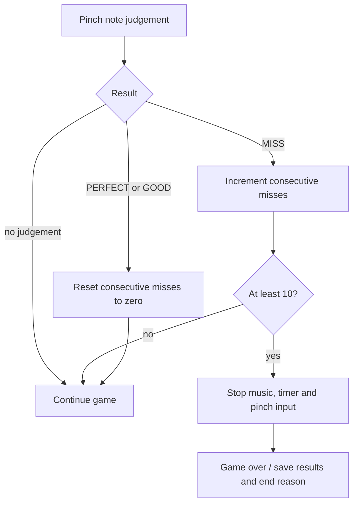

# EXTRACTED: Leap 연속 MISS 종료

```mermaid
flowchart TD
    Judge[Pinch note judgement] --> Result{Result}
    Result -->|MISS| Count[Increment consecutive misses]
    Result -->|PERFECT or GOOD| Reset[Reset consecutive misses to zero]
    Result -->|no judgement| Continue[Continue game]
    Count --> Limit{At least 10?}
    Limit -->|no| Continue
    Limit -->|yes| Finish[Stop music, timer and pinch input]
    Reset --> Continue
    Finish --> Results[Game over / save results and end reason]
```
