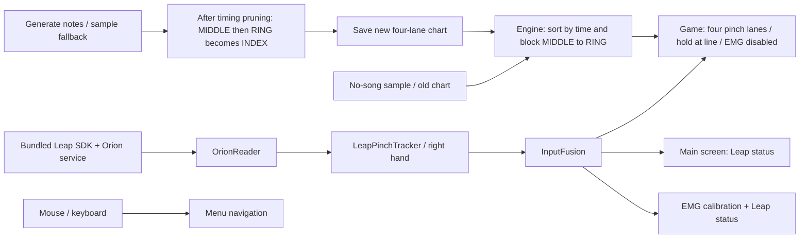

# EXTRACTED: Leap Motion 전용 입력

EXTRACTED: 이 다이어그램은 핀치 입력 경로를 설명한다. 최신 전체 구조의 EMG 분기는 [두 모드 흐름](game-modes.md)을 확인한다.

```mermaid
flowchart LR
    Generation[Generate notes / sample fallback] --> Rule[After timing pruning: MIDDLE then RING becomes INDEX]
    Rule --> Chart[Save new four-lane chart]
    Chart --> Guard[Engine: sort by time and block MIDDLE to RING]
    Sample[No-song sample / old chart] --> Guard
    Guard --> Game
    SDK[Bundled Leap SDK + Orion service] --> Reader[OrionReader]
    Reader --> Pinch[LeapPinchTracker / right hand]
    Pinch --> Fusion[InputFusion]
    Fusion --> Main[Main screen: Leap status]
    Fusion --> Calibration[EMG calibration + Leap status]
    Fusion --> Game[Game: four pinch lanes / hold at line / EMG disabled]
    Mouse[Mouse / keyboard] --> Menus[Menu navigation]
```
