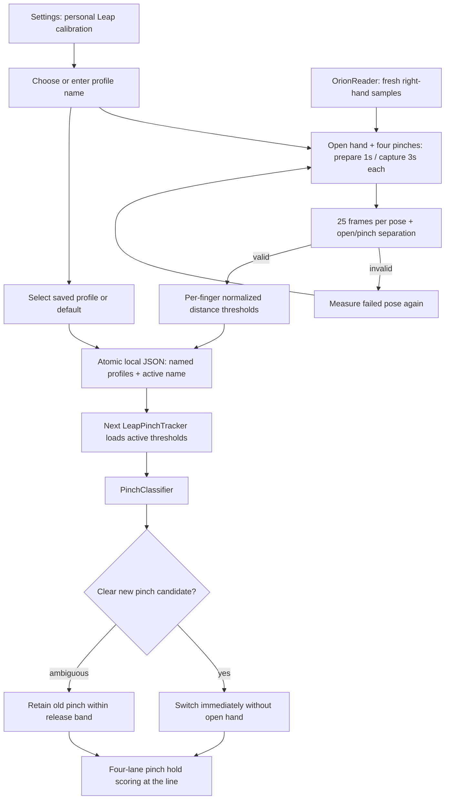

# EXTRACTED: 개인별 Leap 핀치 보정

```mermaid
flowchart TD
    Settings[Settings: personal Leap calibration] --> Name[Choose or enter profile name]
    Name --> Capture[Open hand + four pinches: prepare 1s / capture 3s each]
    Leap[OrionReader: fresh right-hand samples] --> Capture
    Capture --> Validate[25 frames per pose + open/pinch separation]
    Validate -->|invalid| Retry[Measure failed pose again]
    Retry --> Capture
    Validate -->|valid| Calculate[Per-finger normalized distance thresholds]
    Calculate --> Save[Atomic local JSON: named profiles + active name]
    Name --> Existing[Select saved profile or default]
    Existing --> Save
    Save --> Tracker[Next LeapPinchTracker loads active thresholds]
    Tracker --> Classifier[PinchClassifier]
    Classifier --> Candidate{Clear new pinch candidate?}
    Candidate -->|yes| Switch[Switch immediately without open hand]
    Candidate -->|ambiguous| Hold[Retain old pinch within release band]
    Switch --> Game[Four-lane pinch hold scoring at the line]
    Hold --> Game
```
EXTRACTED: 아래는 이전 설정 화면 보정 흐름입니다. 현재 시작 전 보정 흐름은 [새 도식](pre-game-calibration.md)을 확인하세요.
