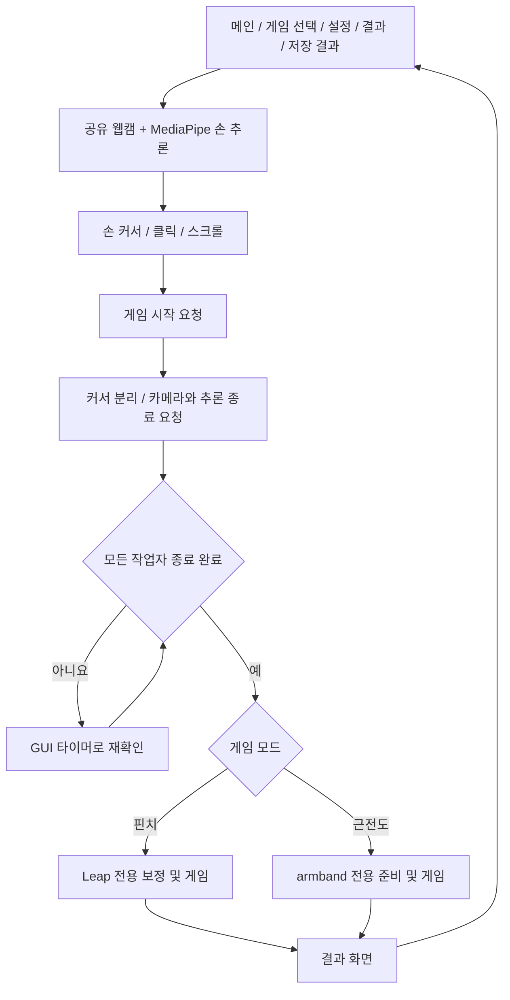

# 메뉴 카메라와 게임 입력의 분리

EXTRACTED: MainWindow와 VideoSession의 현재 수명 제어.

```mermaid
flowchart TD
    M[메인 / 게임 선택 / 설정 / 결과 / 저장 결과] --> C[공유 웹캠 + MediaPipe 손 추론]
    C --> H[손 커서 / 클릭 / 스크롤]
    H --> S[게임 시작 요청]
    S --> D[커서 분리 / 카메라와 추론 종료 요청]
    D --> W{모든 작업자 종료 완료}
    W -->|아니요| T[GUI 타이머로 재확인]
    T --> W
    W -->|예| G{게임 모드}
    G -->|핀치| L[Leap 전용 보정 및 게임]
    G -->|근전도| E[armband 전용 준비 및 게임]
    L --> R[결과 화면]
    E --> R
    R --> M
```
