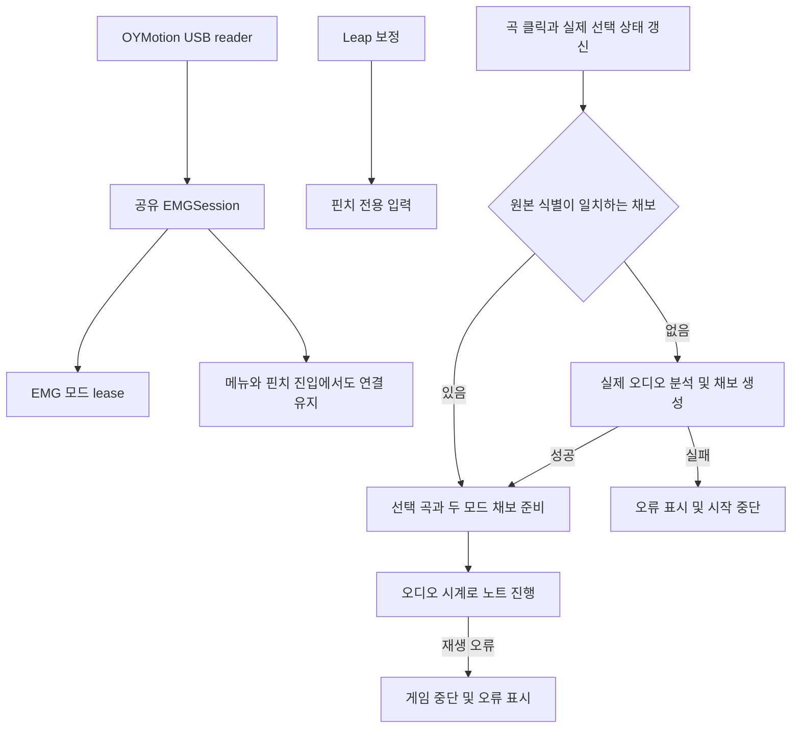

# 연결과 음악 경로

EXTRACTED: 현재 작업 트리 소스 기준이며 새 배포 EXE 검증을 의미하지 않는다.

```mermaid
flowchart TD
    USB[OYMotion USB reader] --> Shared[공유 EMGSession]
    Shared --> Lease[EMG 모드 lease]
    Shared --> Keep[메뉴와 핀치 진입에서도 연결 유지]
    Leap[Leap 보정] --> Pinch[핀치 전용 입력]
    Song[곡 클릭과 실제 선택 상태 갱신] --> Cache{원본 식별이 일치하는 채보}
    Cache -->|있음| Ready[선택 곡과 두 모드 채보 준비]
    Cache -->|없음| Analyze[실제 오디오 분석 및 채보 생성]
    Analyze -->|성공| Ready
    Analyze -->|실패| Error[오류 표시 및 시작 중단]
    Ready --> Play[오디오 시계로 노트 진행]
    Play -->|재생 오류| Stop[게임 중단 및 오류 표시]
```

AMBIGUOUS: 물리 장치 장기 연결과 청감상 박자 일치는 별도 확인이 필요하다.
