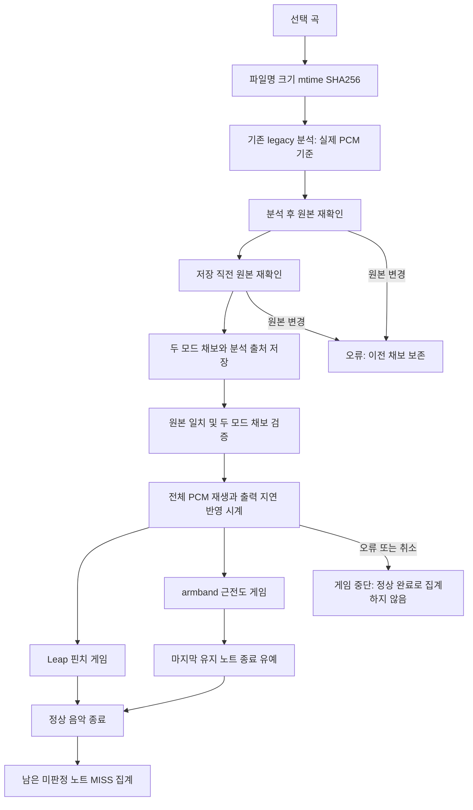

# 음악 원본과 시간축

EXTRACTED: 2026-11-18 구현·자동 검사 기준. 실제 장치 출력 동기화는 별도 실기 항목이다.

```mermaid
flowchart TD
    Song[선택 곡] --> Signature[파일명 크기 mtime SHA256]
    Signature --> Analysis[기존 legacy 분석: 실제 PCM 기준]
    Analysis --> Verify[분석 후 원본 재확인]
    Verify --> Save[저장 직전 원본 재확인]
    Save --> Cache[두 모드 채보와 분석 출처 저장]
    Cache --> Validate[원본 일치 및 두 모드 채보 검증]
    Validate --> Play[전체 PCM 재생과 출력 지연 반영 시계]
    Play --> Pinch[Leap 핀치 게임]
    Play --> EMG[armband 근전도 게임]
    Pinch --> End[정상 음악 종료]
    EMG --> Hold[마지막 유지 노트 종료 유예]
    Hold --> End
    End --> Finalize[남은 미판정 노트 MISS 집계]
    Play -->|오류 또는 취소| Abort[게임 중단: 정상 완료로 집계하지 않음]
    Verify -->|원본 변경| Error[오류: 이전 채보 보존]
    Save -->|원본 변경| Error
```
