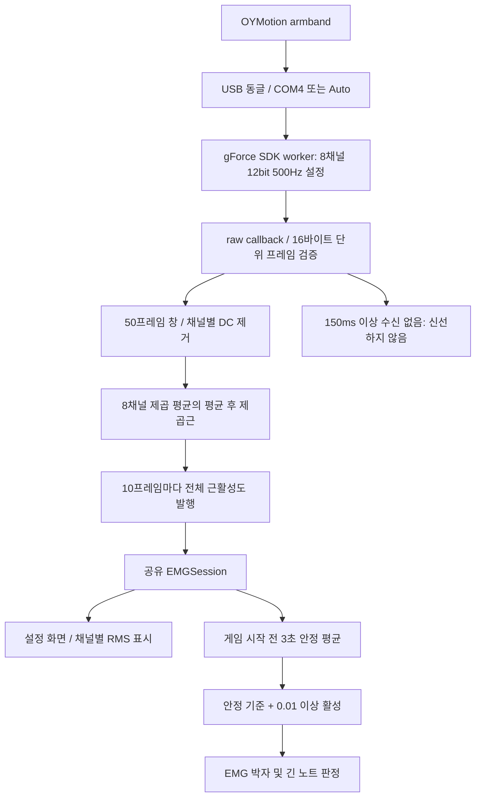

# OYMotion 전체 채널 근활성도

EXTRACTED: 현재 소스의 입력 경로.

```mermaid
flowchart TD
    A[OYMotion armband] --> B[USB 동글 / COM4 또는 Auto]
    B --> C[gForce SDK worker: 8채널 12bit 500Hz 설정]
    C --> D[raw callback / 16바이트 단위 프레임 검증]
    D --> E[50프레임 창 / 채널별 DC 제거]
    E --> F[8채널 제곱 평균의 평균 후 제곱근]
    F --> G[10프레임마다 전체 근활성도 발행]
    G --> H[공유 EMGSession]
    H --> I[설정 화면 / 채널별 RMS 표시]
    H --> J[게임 시작 전 3초 안정 평균]
    J --> K[안정 기준 + 0.01 이상 활성]
    K --> L[EMG 박자 및 긴 노트 판정]
    D --> M[150ms 이상 수신 없음: 신선하지 않음]
```
