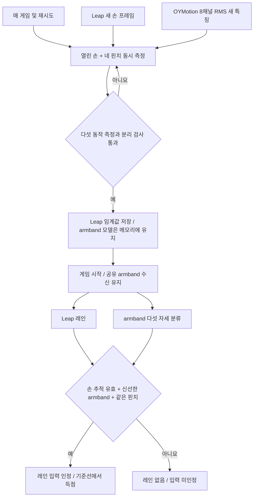

# 핀치 센서 일치 판정

EXTRACTED: 아래는 이전 버전의 일치 필수 경로다. 현재 일반 핀치는 [가중 점수 흐름](weighted-pinch.md)을 사용한다.

EXTRACTED: 현재 보정 및 게임 입력 경로.

```mermaid
flowchart TD
    A[매 게임 및 재시도] --> B[열린 손 + 네 핀치 동시 측정]
    L[Leap 새 손 프레임] --> B
    E[OYMotion 8채널 RMS 새 특징] --> B
    B --> C{다섯 동작 측정과 분리 검사 통과}
    C -->|아니요| B
    C -->|예| D[Leap 임계값 저장 / armband 모델은 메모리에 유지]
    D --> G[게임 시작 / 공유 armband 수신 유지]
    G --> H[Leap 레인]
    G --> I[armband 다섯 자세 분류]
    H --> J{손 추적 유효 + 신선한 armband + 같은 핀치}
    I --> J
    J -->|예| K[레인 입력 인정 / 기준선에서 득점]
    J -->|아니요| N[레인 없음 / 입력 미인정]
```
