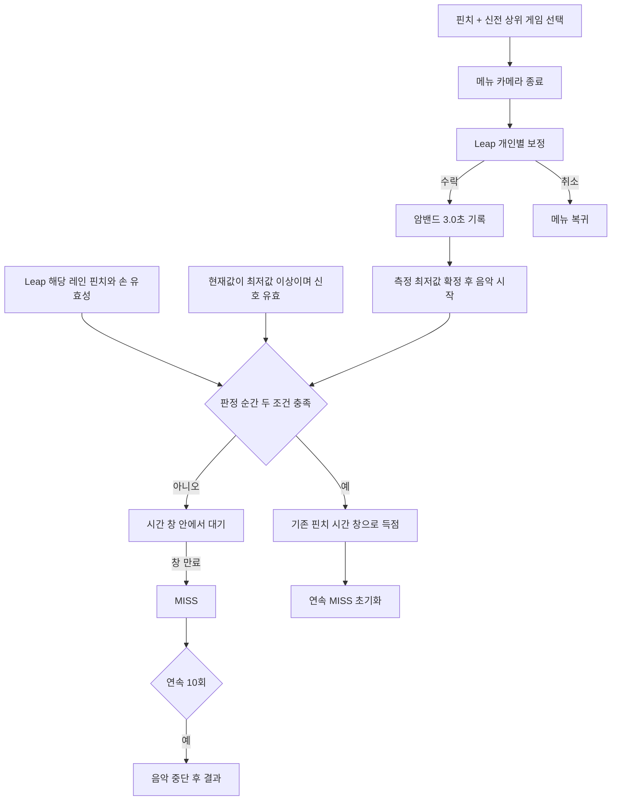

# 상위 핀치 + 신전 동시 판정

EXTRACTED: 2026-11-18 구현 기준. 기본 핀치·근전도 모드는 독립 유지.

```mermaid
flowchart TD
    Choose[핀치 + 신전 상위 게임 선택] --> Stop[메뉴 카메라 종료]
    Stop --> LeapCal[Leap 개인별 보정]
    LeapCal -->|수락| Record[암밴드 3.0초 기록]
    LeapCal -->|취소| Menu[메뉴 복귀]
    Record --> Min[측정 최저값 확정 후 음악 시작]
    Leap[Leap 해당 레인 핀치와 손 유효성] --> Both{판정 순간 두 조건 충족}
    EMG[현재값이 최저값 이상이며 신호 유효] --> Both
    Min --> Both
    Both -->|예| Score[기존 핀치 시간 창으로 득점]
    Both -->|아니오| Wait[시간 창 안에서 대기]
    Wait -->|창 만료| Miss[MISS]
    Miss --> Limit{연속 10회}
    Limit -->|예| End[음악 중단 후 결과]
    Score --> Reset[연속 MISS 초기화]
```
