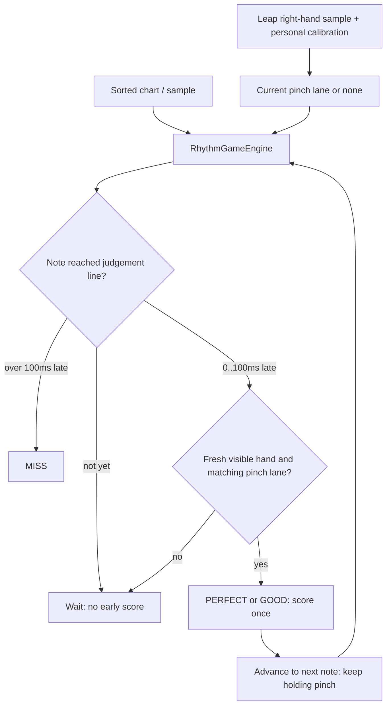

# EXTRACTED: EMG 없는 핀치 유지 점수 판정

```mermaid
flowchart TD
    Leap[Leap right-hand sample + personal calibration] --> Pinch[Current pinch lane or none]
    Notes[Sorted chart / sample] --> Engine[RhythmGameEngine]
    Pinch --> Engine
    Engine --> Time{Note reached judgement line?}
    Time -->|not yet| Wait[Wait: no early score]
    Time -->|over 100ms late| Miss[MISS]
    Time -->|0..100ms late| Match{Fresh visible hand and matching pinch lane?}
    Match -->|no| Wait
    Match -->|yes| Score[PERFECT or GOOD: score once]
    Score --> Next[Advance to next note: keep holding pinch]
    Next --> Engine
```
