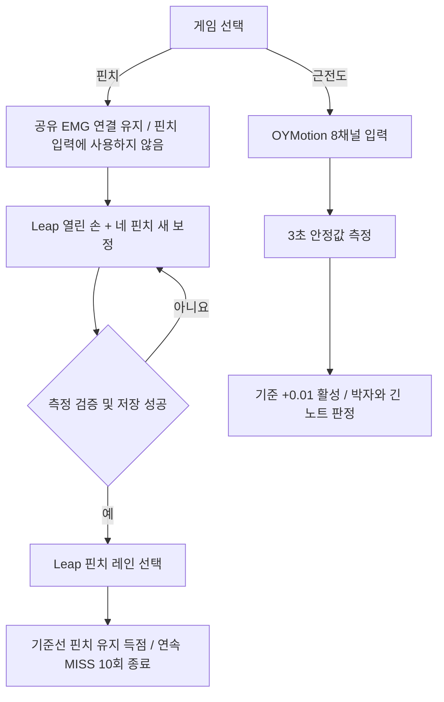

# 핀치와 근전도 게임 입력 분리

EXTRACTED: 현재 두 게임의 독립 입력 경로.

```mermaid
flowchart TD
    A[게임 선택] -->|핀치| P[공유 EMG 연결 유지 / 핀치 입력에 사용하지 않음]
    P --> C[Leap 열린 손 + 네 핀치 새 보정]
    C --> V{측정 검증 및 저장 성공}
    V -->|예| L[Leap 핀치 레인 선택]
    V -->|아니요| C
    L --> J[기준선 핀치 유지 득점 / 연속 MISS 10회 종료]
    A -->|근전도| E[OYMotion 8채널 입력]
    E --> R[3초 안정값 측정]
    R --> N[기준 +0.01 활성 / 박자와 긴 노트 판정]
```
