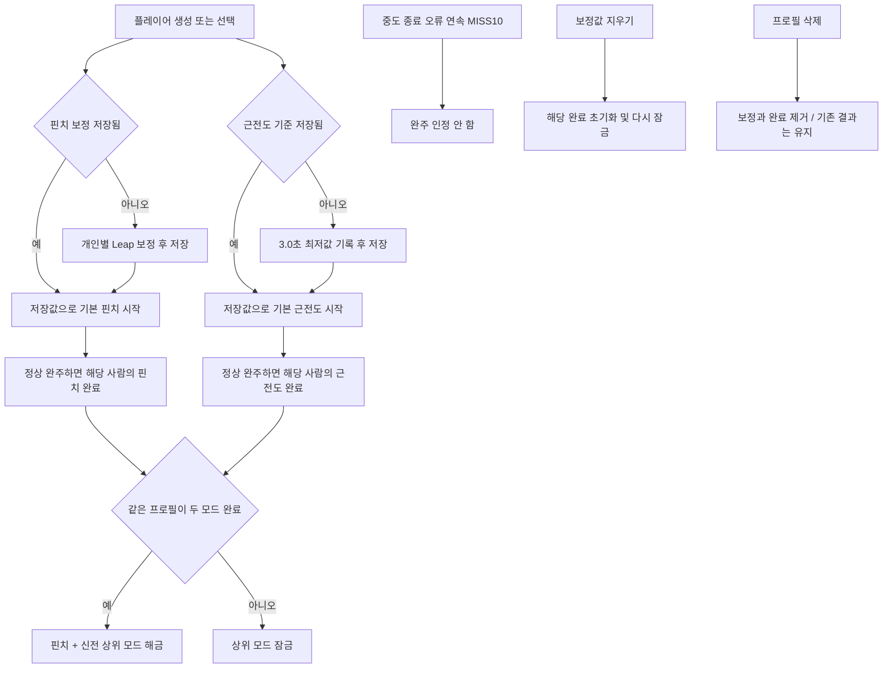

# 플레이어 프로필과 단계 해금

EXTRACTED: 2026-11-18 구현 기준.

```mermaid
flowchart TD
    Select[플레이어 생성 또는 선택] --> Pinch{핀치 보정 저장됨}
    Pinch -->|아니오| PC[개인별 Leap 보정 후 저장]
    Pinch -->|예| PG[저장값으로 기본 핀치 시작]
    PC --> PG
    Select --> EMG{근전도 기준 저장됨}
    EMG -->|아니오| EC[3.0초 최저값 기록 후 저장]
    EMG -->|예| EG[저장값으로 기본 근전도 시작]
    EC --> EG
    PG --> PF[정상 완주하면 해당 사람의 핀치 완료]
    EG --> EF[정상 완주하면 해당 사람의 근전도 완료]
    PF --> Both{같은 프로필이 두 모드 완료}
    EF --> Both
    Both -->|예| Advanced[핀치 + 신전 상위 모드 해금]
    Both -->|아니오| Locked[상위 모드 잠금]
    Exit[중도 종료 오류 연속 MISS10] --> NoCredit[완주 인정 안 함]
    Reset[보정값 지우기] --> Revoke[해당 완료 초기화 및 다시 잠금]
    Delete[프로필 삭제] --> Remove[보정과 완료 제거 / 기존 결과는 유지]
```
