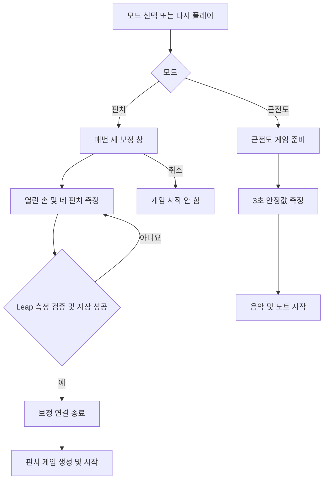

# 게임 시작 전 보정 흐름

EXTRACTED: `MainWindow.show_game_widget`의 시작·재시도 경로.

```mermaid
flowchart TD
    A[모드 선택 또는 다시 플레이] --> B{모드}
    B -->|핀치| C[매번 새 보정 창]
    C --> D[열린 손 및 네 핀치 측정]
    D --> E{Leap 측정 검증 및 저장 성공}
    E -->|예| F[보정 연결 종료]
    F --> G[핀치 게임 생성 및 시작]
    E -->|아니요| D
    C -->|취소| H[게임 시작 안 함]
    B -->|근전도| I[근전도 게임 준비]
    I --> J[3초 안정값 측정]
    J --> K[음악 및 노트 시작]
```
