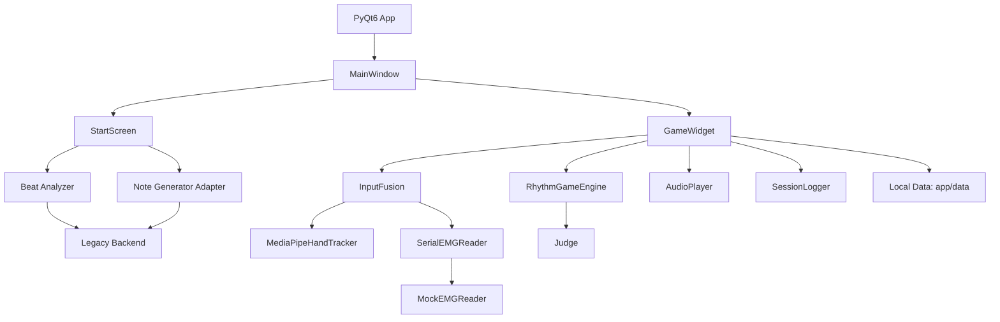

System Overview Diagram

```mermaid
graph TD
    A[PyQt6 App] --> B[MainWindow]
    B --> C[StartScreen]
    B --> D[GameWidget]
    D --> E[InputFusion]
    E --> F[MediaPipeHandTracker]
    E --> G[SerialEMGReader]
    G --> H[MockEMGReader]
    D --> I[RhythmGameEngine]
    I --> J[Judge]
    D --> K[AudioPlayer]
    D --> L[SessionLogger]
    C --> M[Beat Analyzer]
    M --> N[Legacy Backend]
    C --> O[Note Generator Adapter]
    O --> N
    D --> P[Local Data: app/data]
```
