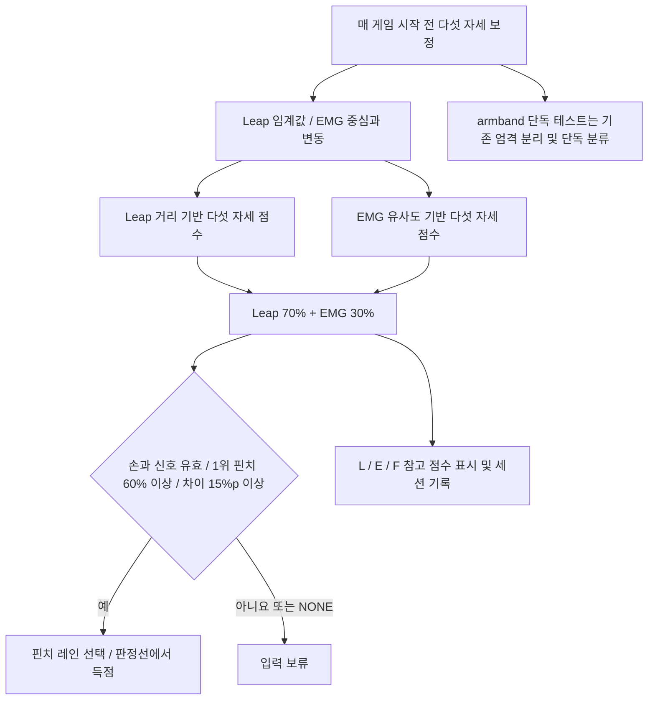

# 가중 핀치 입력 흐름

EXTRACTED: 제거된 가중 판정의 과거 입력 경로다. 현재는 [Leap 전용](pinch-leap-only.md)을 사용한다.

```mermaid
flowchart TD
    A[매 게임 시작 전 다섯 자세 보정] --> B[Leap 임계값 / EMG 중심과 변동]
    B --> L[Leap 거리 기반 다섯 자세 점수]
    B --> E[EMG 유사도 기반 다섯 자세 점수]
    L --> F[Leap 70% + EMG 30%]
    E --> F
    F --> G{손과 신호 유효 / 1위 핀치 60% 이상 / 차이 15%p 이상}
    G -->|예| H[핀치 레인 선택 / 판정선에서 득점]
    G -->|아니요 또는 NONE| I[입력 보류]
    F --> J[L / E / F 참고 점수 표시 및 세션 기록]
    A --> K[armband 단독 테스트는 기존 엄격 분리 및 단독 분류]
```
